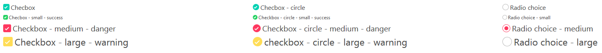

# hnc-bulma-checkradio

Bulma extension to display better checkbox and radio inputs.

## Documentation & Demo

You can find the Documentation and a demo [here](https://wikiki.github.io/form/checkradio/)

## Notes

This is the continuation of the [bulma-checkradio](https://github.com/Wikiki/bulma-checkradio) by [Wikiki](https://github.com/Wikiki).
